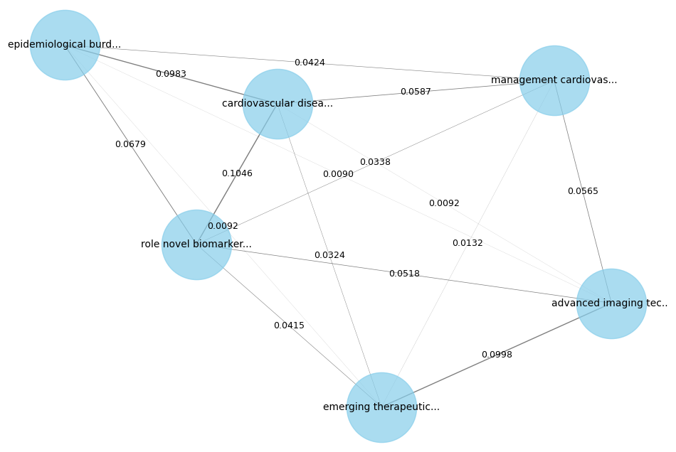

# Knowledge Graph RAG
## Create a graph of interconnected documents and boost performance on RAG

### 1. Install Knowledge Graph RAG:

`pip install knowledge_graph_rag`

### 2. Create a Document Graph:


```
documents = ["Cardiovascular disease ...",
             "Emerging therapeutic interventions ...",
             "The epidemiological burden ...
             "Cardiovascular disease also ...",
             "Advanced imaging techniques, ...",
             "Role of novel biomarkers ..."
]

documents_graph = DocumentsGraph(documents=documents)
documents_graph.plot()
```



### 3. Find interconnected documents
```
documents_containing_connected_terminology = documents_graph.find_connected_documents(vectordb_search_result)
documents_containing_connected_terminology
```

```
[{'document': 'emerging therapeutic intervention ...'},
 {'document': 'management cardiovascular ...'},
 {'document': 'role novel biomarkers ...'}]
 ```
