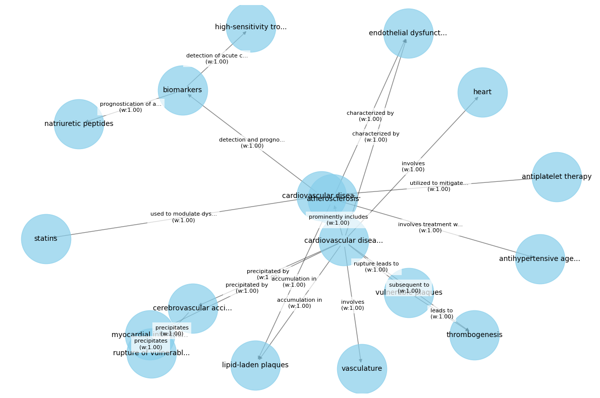
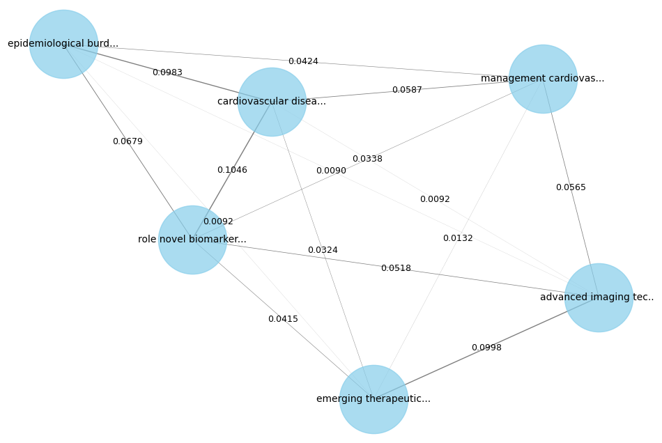

# Knowledge Graph RAG
## Automatically create knowledge graphs + document networks to boost performance on RAG

### 1. Install Knowledge Graph RAG:

`pip install knowledge_graph_rag`

### 2. Create a Knowledge Graph or a Document Graph:

```
# Creating KG on medical documents
documents = ["Cardiovascular disease ...",
             "Emerging therapeutic interventions ...",
             "The epidemiological burden ...
             "Cardiovascular disease also ...",
             "Advanced imaging techniques, ...",
             "Role of novel biomarkers ..."
]
knowledge_graph = KnowledgeGraph(documents)
knowledge_graph.create()
knowledge_graph.plot()
```


```
documents_graph = DocumentsGraph(documents=documents)
documents_graph.plot()
```


### 3. Search knowledge graph entities or find interconnected documents, to augment your LLM context:

```
knowledge_graph.search_document(user_query)
```

```
>> Entity: cardiovascular disease
  -> antihypertensive agents (Relationship: involves treatment with)
  -> statins (Relationship: used to modulate dyslipidemia)
  -> antiplatelet therapy (Relationship: utilized to mitigate thrombosis risk)
  -> biomarkers (Relationship: detection and prognostication of acute coronary syndromes and heart failure)
  -> high-sensitivity troponins (Relationship: detection of acute coronary syndromes and heart failure)
  -> natriuretic peptides (Relationship: prognostication of acute coronary syndromes and heart failure)
  ```


```
documents_containing_connected_terminology = documents_graph.find_connected_documents(vectordb_search_result)
documents_containing_connected_terminology
```

```
>> [{'document': 'emerging therapeutic intervention ...'},
 {'document': 'management cardiovascular ...'},
 {'document': 'role novel biomarkers ...'}]
 ```


## Star History

[](https://star-history.com/#sarthakrastogi/graph-rag&Date)